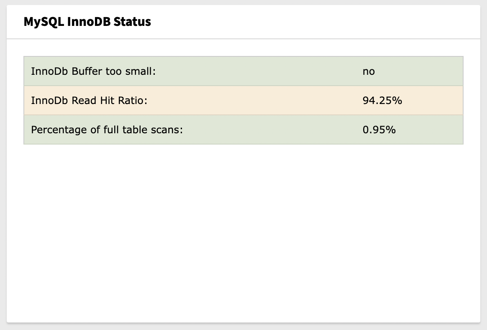

..  include:: /Includes.rst.txt

..  _introduction:

============
Introduction
============

..  _what-it-does:

What does it do?
================

This extension adds two widgets for TYPO3 dashboard to display data about
used MySQL InnoDB data.

Screenshots
===========

..  figure:: ../Images/MySQLInnoDBBufferPoolWidget.png
    :width: 500px
    :align: left
    :alt: MySQL InnoDB Buffer Pool Widget

