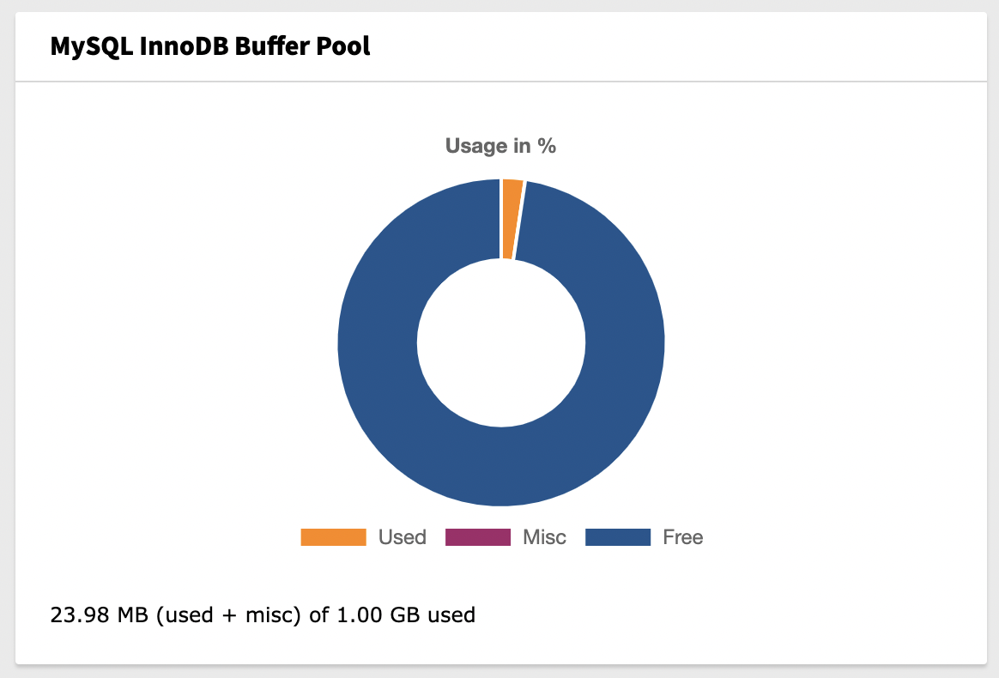

..  include:: /Includes.rst.txt

..  _introduction:

============
Introduction
============

..  _what-it-does:

What does it do?
================

This extension adds two widgets for TYPO3 dashboard to display data about
used MySQL InnoDB data.

Screenshots
===========

